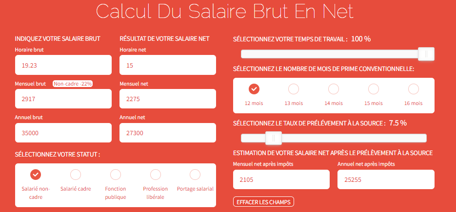
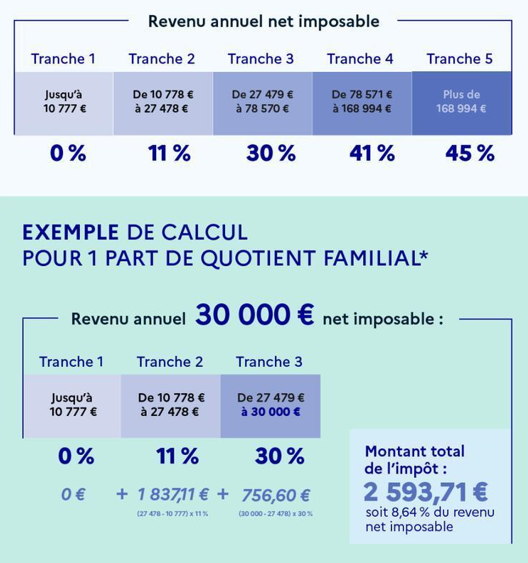

```{r setup, include=FALSE}
knitr::opts_chunk$set(echo = TRUE)
```

# Ressources documentaires

Pour réaliser ce TP, vous aurez besoin des ressources suivantes :

- [Les listes](https://asardell.github.io/programmation-r/manipulation-objet.html#liste)
- [Les fonctions](https://asardell.github.io/programmation-r/presentation.html#fonctions)
- [Les fonctions de tests et opérateurs de comparaison](https://asardell.github.io/programmation-r/presentation.html#fonctions-de-tests-et-comparaisons)
- [Construire une fonction](https://asardell.github.io/programmation-r/algo.html#construire-une-fonction)
- [Construire une structure conditionnelle](https://asardell.github.io/programmation-r/algo.html#construire-une-structure-conditionnelle)
- [Construire une boucle](https://asardell.github.io/programmation-r/algo.html#construire-une-boucle)

# Exercices

Pour rendre ce TP, voici les étapes à suivre :

1. Créer une branche **tp1** sur votre repository github que vous avez déjà ouvert. Le tp sera pousser dans cette branche
2. Dans cette branche, créer un dossier **tp1** dans lequel vous pourrez pousser le script avec votre code
3. Si vous êtes en public, envoyer le lien de votre repository par mail à *anthony.sardellitti@hotmail.fr* **OU** si vous êtes en privé, ajouter cette adresse mail en tant que collaborateur de votre repository. 

Pensez à commenter votre code.

## Salaire net

Dans cet exercice, vous allez devoir programmer plusieurs fonctions pour calculer le salaire net à partir d'un salaire brut. Cette [page web](https://www.salaire-brut-en-net.fr/) vous sera utile pour comprendre les éléments qui interviennent dans le calcul. Pour faciliter le développement, utilisez uniquement le salaire brut mensuel.

<p>
{width=600px}
</p>

### Brut vers Net avant impôt pour les non-cadres uniquement

Programmez une fonction appelée *brutToNet1* qui prend en entrée un salaire brut mensuel. La fonction retourne le salaire net avant impôt pour les non cadres. 
Nous souhaitons également que la fonction gère les erreurs si les arguments donnés à la fonction ne sont pas du bon type (ex : le salaire brut doit-être numeric). En cas d'erreur, la fonction doit renvoyer "ERROR : type not expected".
Pour information, les non-cadres ont un 22% de cotisations salariales.
Pensez à tester votre fonction pour vous autocorriger.

### Brut vers Net après impôt pour cadres et non-cadres

Programmez une fonction appelée *brutToNet2* qui prend en entrée un salaire brut mensuel et le statut du contrat (cadre/non-cadres). Le taux de prélèvement à la source est fixe à 7,5%. La fonction retourne le salaire net après impôt. 
Pour information, les non-cadres ont un 22% de cotisations salariales contre 25% pour les cadres. 
Nous souhaitons également que la fonction gère les erreurs si l'argument contrat n'est pas correct. Pour cette erreur, la fonction doit renvoyer "ERROR : contract unknown".
Pensez à tester votre fonction pour vous autocorriger.

### Brut vers Net après impôt pour cadres et non-cadres

Programmez une fonction appelée *brutToNet3* qui prend en entrée : 

* un salaire brut mensuel (obligatoire)
* le statut du contrat cadre/non-cadres (obligatoire)
* le taux de prélèvement à la source (par défaut 7,5%)
* le temps de travail entre 0 et 100% (par défaut 100%)

La fonction retourne une liste avec deux objets :

* le salaire net avant impôt
* le salaire net après impôt

Nous souhaitons également que la fonction gère les erreurs si  taux de prélèvement et le temps de travail ne sont pas compris entre 0 et 100%.
En cas d'erreur, la fonction doit renvoyer "ERROR : rate and time must be in range(0,100)".
Pensez à tester votre fonction pour vous autocorriger.


## Relevé d'imposition

Qui dit alternance, dit impôt sur le revenu ! 
Cet exercice n'a aucun lien avec le précédent. 
Programmez une fonction appelée *netAnnuelToImpot* qui prend en entrée un salaire net annuel imposable. 
La fonction doit retourner le montant total de l'impôt.
Voici comment calculer le montant total de l'impôt :

<p>
{width=300px}
</p>


## Juste prix

Dans cet exercice, vous allez coder le jeu du juste prix.

<p>
{width=150px}
</p>

Le joueur doit deviner un prix (entier), il fait des propositions en saisissant au clavier et à chaque proposition le programme lui dit si "c’est plus" ou si "c’est moins. Il gagne lorsqu’il a trouvé le juste prix.

Le joueur choisit le mode du jeu entre :

* Mode facile : le joueur a autant de tentatives qu’il souhaite et le jeu doit s’arrêter lorsque le
joueur a trouvé le prix
* Mode difficile : le joueur n’a que 10 essais pour trouver le nombre mystère ; si le joueur
trouve en moins de 10 essais il gagne et la partie s’arrête, sinon il perd.

Voici la ligne de commande pour demander à l'utilisateur de saisir une valeur :

```{r, eval=FALSE}
user_choice <- readline(prompt = "Saisissez une valeur textuelle : ")
```

Pour simuler le choix de l'ordinateur, vous pouvez utiliser la fonction suivante :

```{r, eval=FALSE}
ai_choice <- sample(x = 1:100,size = 1)
```

## Pierre, feuille, ciseaux

Dans ce jeu, l'utilisateur peut jouer plusieurs parties. La fonction prend en entrée le nombre de parties que le joueur souhaite faire.
Pour chaque partie l'utilisateur saisit son choix au clavier et le programme retourne ensuite une liste avec :

* le choix du programme
* si l'utilisateur a gagné, perdu, ou fait match nul

La fonction doit retourner le nombre de partie gagnante pour l'utilisateur lorsque toutes les parties ont été jouées.

Pour simuler le choix de l'ordinateur, vous pouvez utiliser la fonction suivante :

```{r, eval=FALSE}
ai_choice <- sample(x = c("Pierre","Feuille","Ciseaux"),size = 1)
```

